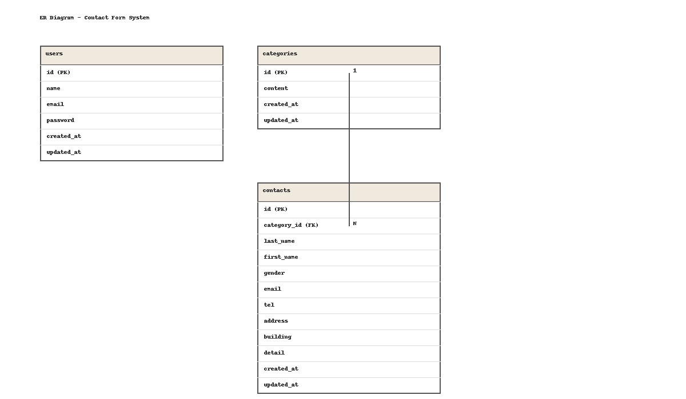

# アプリケーション名

Laravel お問い合わせフォームアプリ（contactform-test1）

## 概要

Laravel を用いて実装したお問い合わせフォームアプリケーションです。  
ユーザーは公開ページからお問い合わせを送信でき、管理者はログインしてお問い合わせ一覧の確認・検索・CSV エクスポート・削除などを行うことができます。

認証機能は Laravel Fortify をベースに、FormRequest を用いたバリデーションとカスタムエラーメッセージで要件を満たすように実装しています。

---

## 環境構築

### リポジトリをクローン

```bash
git clone git@github.com:TAKAMASA-otk/contactform-test1.git
cd contactform-test1


# 環境変数ファイルを作成

cp .env.example .env

# 依存パッケージをインストール

composer install
npm install # 必要な場合

# アプリケーションキーを生成

php artisan key:generate

# .env の DB 設定を編集（MySQL など）

DB_CONNECTION=mysql
DB_HOST=mysql
DB_PORT=3306
DB_DATABASE=contactform_test1
DB_USERNAME=root
DB_PASSWORD=secret

# マイグレーション・シーディング

php artisan migrate --seed

# 開発サーバー起動

php artisan serve

## 開発環境 URL

-   お問い合わせ入力フォーム  
     http://localhost/
-   会員登録ページ（Fortify）  
     http://localhost/register
-   ログインページ  
     http://localhost/login
-   管理画面（ログイン後）  
     http://localhost/admin
-   phpMyAdmin  
     http://localhost:8080/

## ## 使用技術（実行環境）

-   PHP 8.2.11
-   Laravel 8.83.8
-   Laravel Fortify
-   MySQL 8.0
-   nginx 1.21
-   jQuery 3.7.1（管理画面モーダルに使用）
-   Docker / docker-compose

## 機能一覧（要件対応）

### US001〜US003：お問い合わせフォーム〜確認〜サンクス

-   お問い合わせ入力（`/`）

    -   姓・名に分かれたお名前入力
    -   性別（「男性」「女性」「その他」）
        -   値は `1:男性 / 2:女性 / 3:その他`
    -   メールアドレス
    -   電話番号（3 項目に分割入力）
    -   住所
    -   建物名（任意）
    -   お問い合わせの種類（categories テーブルを参照）
    -   お問い合わせ内容

-   確認画面（`/confirm`）

    -   入力内容の表示
        -   姓名の間にはスペースを入れて表示
        -   性別は「男性」「女性」「その他」で表示
        -   電話番号はハイフンなしで表示
    -   「送信」「修正」ボタン
        -   修正ボタンで入力画面に戻る際、入力値は保持

-   サンクスページ（`/thanks`）

    -   送信完了メッセージ
    -   HOME ボタンで初期状態のフォーム（`/`）へ遷移

-   バリデーション
    -   `App\Http\Requests\ContactRequest` にて FormRequest を利用
    -   仕様書で指定された日本語エラーメッセージを実装
    -   エラーは各項目の直下に赤文字で表示

---

### US004〜US005：会員登録・ログイン（Fortify）

-   会員登録（`/register`）

    -   必須項目
        -   お名前（name）
        -   メールアドレス（email）
        -   パスワード（password）
    -   FormRequest（`App\Http\Requests\RegisterRequest`）でバリデーション
        -   お名前：必須
        -   メールアドレス：必須・メール形式・ユニーク
        -   パスワード：必須・8 文字以上
    -   エラーメッセージ
        -   お名前未入力：「お名前を入力してください」
        -   メール未入力：「メールアドレスを入力してください」
        -   メール形式エラー：「メールアドレスはメール形式で入力してください」
        -   パスワード未入力：「パスワードを入力してください」
    -   登録成功後、管理画面（`/admin`）へ遷移

-   ログイン（`/login`）

    -   必須項目
        -   メールアドレス
        -   パスワード
    -   FormRequest（`App\Http\Requests\LoginRequest`）＋ Fortify カスタマイズでバリデーション
        -   メール：必須・メール形式
        -   パスワード：必須
    -   認証ロジック
        -   `App\Providers\FortifyServiceProvider` にて `Fortify::authenticateUsing()` を利用
        -   入力メールアドレスでユーザーを取得し、`Hash::check` でパスワード照合
        -   認証失敗時：
            -   パスワード項目に  
                **「ログイン情報が登録されていません」**  
                というメッセージを表示（仕様書の文言に合わせて固定）

-   認証動線
    -   ユーザー登録ページヘッダーから `Login` へ
    -   ログインページヘッダーから `Register` へ
    -   ログイン成功時は `/admin` に遷移
    -   ログアウト（`POST /logout`）ボタンは管理画面ヘッダーに配置

---

### US006〜US007：管理画面（一覧・検索・詳細・削除・CSV）

-   管理画面トップ（`/admin`）

    -   認証必須（`auth` ミドルウェア）
    -   お問い合わせ一覧：
        -   お名前
        -   性別（「男性」「女性」「その他」）
        -   メールアドレス
        -   お問い合わせの種類（categories テーブルの content）
        -   「詳細」ボタン
    -   ページネーション：
        -   7 件ずつ表示
        -   Bootstrap4 風のカスタムデザイン（`admin.css`）  
            で装飾したページネーション UI

-   検索機能（`GET /search`）

    -   条件
        -   キーワード（姓・名・フルネーム・メール部分一致）
        -   性別（「性別 / 全て / 男性 / 女性 / その他」）
        -   お問い合わせの種類
        -   日付（`input[type="date"]` で指定）
    -   挙動
        -   上記条件で AND 検索
        -   検索結果にもページネーションを適用
        -   「リセット」ボタンで検索条件をクリアして `/admin` に戻る

-   詳細モーダル

    -   「詳細」ボタンでモーダルウィンドウを表示
    -   表示項目
        -   お名前
        -   性別
        -   メールアドレス
        -   電話番号
        -   住所
        -   建物名
        -   お問い合わせの種類
        -   お問い合わせ内容
    -   右上の × ボタン、または背景クリックで閉じる

-   削除機能

    -   モーダル内の「削除」ボタンで対象データを削除
    -   削除後は管理画面トップにリダイレクトし、  
        フラッシュメッセージを表示

-   CSV エクスポート（応用）
    -   「エクスポート」ボタンで現在の一覧を CSV 出力
        -   検索条件で絞り込んだ状態も対象
    -   出力内容
        -   お名前
        -   性別
        -   メールアドレス
        -   お問い合わせの種類
        -   お問い合わせ内容
        -   作成日
    -   文字化け防止のため BOM 付き UTF-8 で出力

---

### US008：ログアウト

-   管理画面ヘッダーの `logout` ボタンから `POST /logout` を実行
-   セッションを破棄してログイン画面へ戻る

---

## ルーティング一覧（主要なもの）

use App\Http\Controllers\ContactController;
use App\Http\Controllers\AdminController;
use App\Http\Controllers\RegisterController;
use App\Http\Controllers\LoginController;

// お問い合わせフォーム（PG01〜PG03）
Route::get('/', [ContactController::class, 'showInput'])->name('contact.input');
Route::post('/confirm', [ContactController::class, 'confirm'])->name('contact.confirm');
Route::post('/thanks', [ContactController::class, 'send'])->name('contact.send');

// 認証（PG08〜PG10）
Route::get('/register', [RegisterController::class, 'show'])->name('register');
Route::post('/register', [RegisterController::class, 'register']);

Route::get('/login', [LoginController::class, 'show'])->name('login');
Route::post('/login', [LoginController::class, 'login']);

Route::post('/logout', [LoginController::class, 'logout'])->name('logout');

// 管理画面（PG04〜PG07）※ログイン必須
Route::middleware('auth')->group(function () {
    Route::get('/admin',  [AdminController::class, 'index'])->name('admin.index');
    Route::get('/search', [AdminController::class, 'search'])->name('admin.search');
    Route::get('/reset',  [AdminController::class, 'reset'])->name('admin.reset');
    Route::get('/export', [AdminController::class, 'export'])->name('admin.export');
    Route::post('/delete', [AdminController::class, 'delete'])->name('admin.delete');
});

#### ER図
